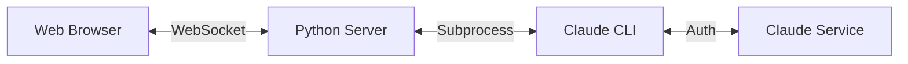

# Open Chat Interface

A browser-based chat interface that directly connects to your local Claude CLI installation, providing real-time streaming capabilities without requiring API keys. This implementation leverages your existing Claude Pro/Max authentication through the Claude CLI.

## 🎯 Overview

Open Chat Interface provides a web-based UI for interacting with Claude using your existing Claude CLI authentication. It creates a bridge between your browser and the Claude CLI tool, enabling you to chat with Claude through a modern web interface while maintaining all your existing authentication and settings.

## ✨ Features

- **No API Keys Required**: Uses your existing Claude CLI authentication (Claude Pro/Max)
- **Real-time Streaming**: See Claude's responses character-by-character as they're generated
- **Tool Visibility**: Watch Claude use tools (Bash, Read, Edit, Write) in real-time
- **Agentic Interface**: Full transparency into what Claude is doing
- **Session Management**: Maintains conversation context across messages
- **Markdown Support**: Full markdown rendering with syntax highlighting
- **Clean UI**: Modern, responsive interface optimized for conversation
- **Local Only**: Everything runs on your machine - no external API calls
- **Optimized Performance**: ~7 second response time (Claude CLI baseline)

## 📋 Prerequisites

1. **Claude CLI** installed and authenticated
   - You need an active Claude Pro or Claude Max subscription
   - Claude CLI must be installed and accessible via the `claude` command
   - You must be logged in: `claude auth login`

2. **Python 3.8+** installed on your system

3. **Modern Web Browser** (Chrome, Firefox, Safari, Edge)

## 🚀 Quick Start

### 1. Clone the Repository

```bash
git clone https://github.com/trinath-y/open-chat-interface.git
cd open-chat-interface
```

### 2. Install Dependencies

```bash
cd backend
pip install -r requirements.txt
```

### 3. Verify Claude CLI

```bash
# Check if Claude CLI is installed and authenticated
claude --version

# If not authenticated, login first:
claude auth login
```

### 4. Start the Server

```bash
python server.py
```

The server will start on `http://localhost:3000`

### 5. Open in Browser

Navigate to `http://localhost:3000` in your web browser and start chatting!

## 🏗️ Project Structure

```
open-chat-interface/
├── backend/
│   ├── server.py           # Streaming server with tool visibility
│   ├── requirements.txt    # Python dependencies
│   └── archive/           # Previous implementations (for reference)
│       ├── server_original.py  # Original JSON mode (45-53s)
│       └── server_fast.py      # Plain text mode (11-16s)
├── frontend/
│   └── index.html         # Web interface with real-time updates
├── .claude/
│   └── commands/
│       └── agentic-todo.md # Enhancement roadmap
└── README.md              # This file
```

## ⚙️ Configuration

Configure the server using environment variables:

```bash
# Server Configuration
export WEB_PORT=3000              # Port for web server (default: 3000)
export WEB_HOST=0.0.0.0          # Bind address (default: 0.0.0.0)

# Claude CLI Configuration
export CLAUDE_COMMAND=claude      # Path to Claude CLI (default: claude)

# Start server with configuration
python backend/server.py
```

## 🔧 How It Works

### Architecture Overview



1. **Browser**: Provides the chat UI and sends messages via WebSocket
2. **Python Server**: Bridges between the browser and Claude CLI
3. **Claude CLI**: Handles authentication and communication with Claude
4. **Claude Service**: The actual Claude AI service (using your Pro/Max subscription)

### Communication Flow

1. User types a message in the browser
2. Message sent to Python server via WebSocket
3. Server executes Claude CLI with `--print` flag
4. Claude CLI uses your existing authentication
5. Response streamed back to browser character-by-character

## 🐳 Docker Support

Build and run with Docker:

```dockerfile
# Dockerfile
FROM python:3.11-slim

WORKDIR /app

# Copy backend files
COPY backend/requirements.txt backend/
RUN pip install -r backend/requirements.txt

COPY backend/ backend/
COPY frontend/ frontend/

# Note: Claude CLI must be installed in the container
# This depends on your specific setup

EXPOSE 3000
CMD ["python", "backend/server.py"]
```

Build and run:
```bash
docker build -t open-chat-interface .
docker run -p 3000:3000 open-chat-interface
```

## 🚨 Troubleshooting

### Claude CLI Not Found

```bash
# Check if claude is in PATH
which claude

# If not found, add to PATH
export PATH="$PATH:/path/to/claude"
```

### Authentication Issues

```bash
# Re-authenticate Claude CLI
claude auth login

# Verify authentication
claude --print "test"
```

### Port Already in Use

```bash
# Use a different port
export WEB_PORT=8080
python backend/server.py
```

### Connection Refused

- Ensure the server is running
- Check firewall settings
- Verify the port is correct

## 🔐 Security Notes

- **Local Only**: All processing happens on your machine
- **No API Keys**: Uses your existing Claude CLI authentication
- **Session Isolation**: Each browser session is isolated
- **Process Safety**: Claude CLI processes are properly managed and cleaned up

## 🚀 Future Enhancements

See [.claude/commands/agentic-todo.md](.claude/commands/agentic-todo.md) for planned features including:

- Tool call visibility and approval
- File system integration
- Interactive feedback for Claude's actions
- MCP server support
- Enhanced permission controls

## 🤝 Contributing

Contributions are welcome! This project demonstrates:

- WebSocket/SocketIO communication patterns
- Subprocess management in Python
- Real-time streaming interfaces
- CLI tool integration with web UIs

Feel free to:
- Report issues
- Suggest enhancements
- Submit pull requests
- Fork for your own use

## 📄 License

MIT License - See [LICENSE](LICENSE) file for details

## 🙏 Acknowledgments

- Architecture patterns inspired by OpenCode
- Built for the Claude community
- Designed to work with Claude Pro/Max subscriptions

## ⚡ Performance

- **First Response**: ~1-2 seconds
- **Streaming Rate**: Real-time character streaming
- **Memory Usage**: ~50MB per session
- **Concurrent Sessions**: Limited by system resources

## 📞 Support

- **Issues**: [GitHub Issues](https://github.com/trinath-y/open-chat-interface/issues)
- **Documentation**: This README and code comments
- **Community**: Claude Discord/Forums

---

**Note**: This tool requires an active Claude Pro or Claude Max subscription and the Claude CLI tool installed on your system. It does not work with API keys - it uses your browser-authenticated Claude session through the CLI.